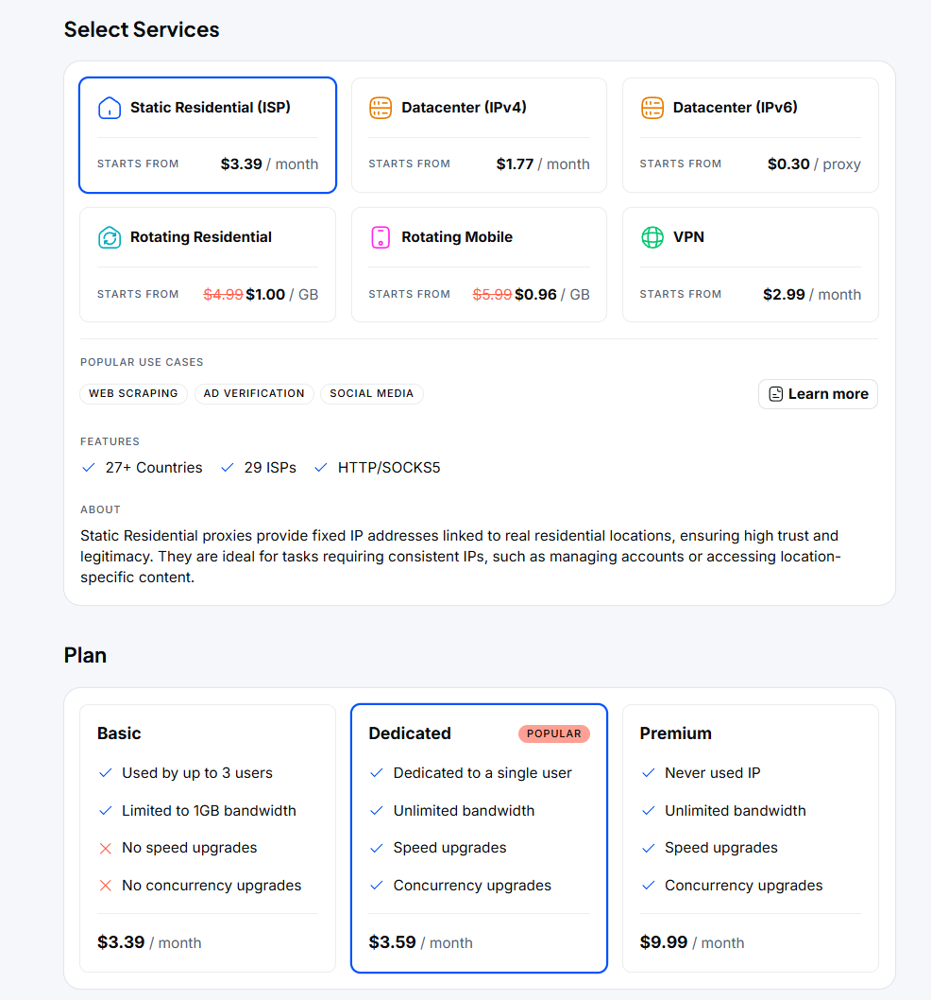
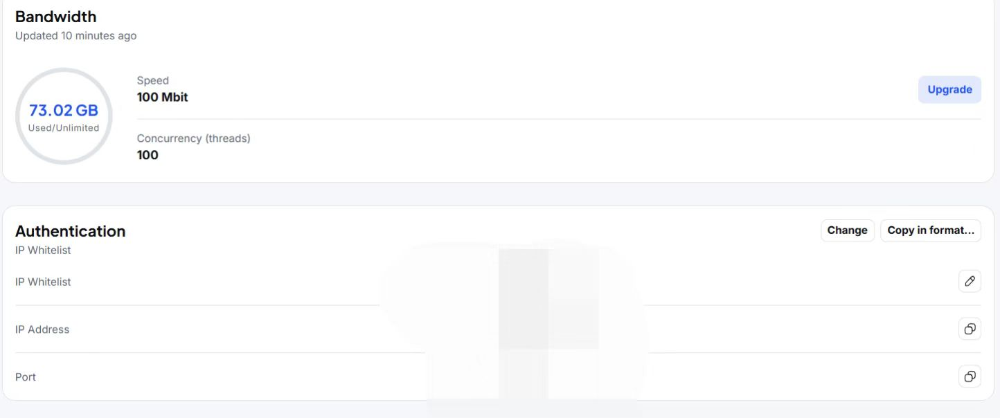

# 搭建稳定的claude和chatgpt使用网络——2025版

大家可能听说Claude 风控严重，容易封号。然而实际情况是 **ChatGPT 对 IP 纯净度的限制更严格变态，并且降智的时候不会有提示**。目前ds生态，多模态，稳定性，性能和openai以及claude依然有很大差距。如果写代码比较多，claude依然是不可或缺的，而且短期看我认为这两者很难有替代品，差距实际上是在扩大的。因此如果你有使用满血claude和chatgpt需求可以参考这个指南。

## 1. 使用北美家庭ip构建节点
由于风控会识别你是否使用vpn登陆ip节点，因此直连北美家庭ip节点很容易被识别，所以在这里需要构建一个转跳的代理链，整体代理链如下。

本机—vps-北美家庭ip-网络

接下里会教你如何配置这个过程。

### 北美家庭ip是什么

**北美家庭 IP** 是分配给美国、加拿大等家庭用户的网络地址。

它的特点：
* 来自真实家庭网络，不是服务器。（假的）
* 更不容易被网站封锁或识别为机器人。(真的)
* 更适合登录网站、自动化操作、访问仅限北美的网站。

用途举例：
* 注册账号更安全
* 爬虫更难被封
* 访问 Netflix 等北美专属内容

### 北美静态家庭ip的选择

你在这里需要购买一个北美静态家庭ip（动态的只适合做爬虫）当前很多运行商会把一个ip给多人使用这也是不行的，**购买时候要注意是不是你个人独享** 。非共享静态家庭ip一般价格高昂。这里推荐一个适合个人使用的proxy-cheap.com （仅做推荐，你也可以找到更好的服务商）

这里需要注意购买Dedicated及以上的plan

**** 

然后你就可以进入你购买的ip


* **IP Whitelist** 这里需要填入你vps的ip

* **IP Address** 这是你的服务器ip

* **Port** 端口

## 2. 搭建vps

现在需要构建一个转跳的vps，vps实际上就是一个小的虚拟服务器。理论上你用vpn转跳也是可以的。但是商用vpn节点可能上万人一起使用，要小心你的北美家庭ip泄露。不过要是组里的节点就另当别论，感觉也是可以的。

### 购买vps和配置

这里仅推荐搬瓦工 [https://bandwagonhost.com/](https://bandwagonhost.com/) 这是当前最稳定的vps机房运行商（价格也相对贵一点） 你也可以选择其他供应商。

购买最便宜的vps机房就可以。bandwagonhost攻略很多，这里就不赘述。组里应该有教过如何配置和连接ssh以及配置unbuntu服务器。

### 配置vps


本指南将帮助您在Ubuntu系统上设置Xray代理链，通过搬瓦工VPS转发到北美静态ip上网。

#### 前提条件

- 一台运行Ubuntu的搬瓦工VPS
- 具有root或sudo权限
- 基本的命令行操作知识

#### 步骤一：获取VPS的IP地址

在设置之前，您需要知道自己VPS的IP地址：

```bash
curl ifconfig.me
```

或者

```bash
curl ip.sb
```

- 记下显示的IP地址，这是您的VPS公网IP，后续客户端连接时需要用到。

**将vps ip加入北美静态ip白名单**

回到**第一步的proxy**将第获得的**VPS公网IP** 加入第一步你的北美静态ip * **IP Whitelist** **这里需要填入你vps的ip** 同时将**Protocol**更改为HTTP


#### 步骤二：安装Xray

首先，更新系统并安装必要的工具：

```bash
apt update
apt upgrade -y
apt install curl socat -y
```

接下来，使用官方脚本安装Xray：

```bash
bash -c "$(curl -L https://github.com/XTLS/Xray-install/raw/main/install-release.sh)" @ install
```

#### 步骤三：配置Xray密钥

为Reality协议生成密钥对：

```bash
xray x25519
```

这将输出类似以下内容：
```
Private key: [您的私钥]
Public key: [您的公钥]
```

记下私钥(Private key)，后面需要用到。

#### 步骤四：创建配置文件（一般都有不用创建）

1. 创建配置目录（如果不存在）：

```bash
mkdir -p /usr/local/etc/xray/
```

2. 编辑配置文件：

```bash
nano /usr/local/etc/xray/config.json
```

3. 复制以下配置到文件中（重点关注443端口和代理链设置）：

```json
{
    "log": {
      "loglevel": "debug",
      "access": "/var/log/xray/access.log",
      "error": "/var/log/xray/error.log"
    },
    "inbounds": [
      {
        "tag": "Reality-Proxy",
        "listen": "0.0.0.0",
        "port": 443,
        "protocol": "vless",
        "settings": {
          "clients": [
            {
              "id": "[您的UUID]",
              "flow": "xtls-rprx-vision"
            }
          ],
          "decryption": "none"
        },
        "streamSettings": {
          "network": "tcp",
          "security": "reality",
          "realitySettings": {
            "show": false,
            "dest": "www.microsoft.com:443",
            "serverNames": [
              "www.microsoft.com",
              "microsoft.com"
            ],
            "privateKey": "[您的私钥]",
            "shortIds": [
              "[您的shortId]"
            ]
          }
        },
        "sniffing": {
          "enabled": true,
          "destOverride": [
            "http",
            "tls",
            "quic"
          ]
        }
      }
    ],
    "outbounds": [
      {
        "protocol": "http",
        "tag": "proxy",
        "settings": {
          "servers": [
            {
              "address": "[北美家庭IP]",
              "port": [北美家庭ip端口]
            }
          ]
        }
      },
      {
        "protocol": "freedom",
        "tag": "direct",
        "settings": {
          "domainStrategy": "UseIP"
        }
      },
      {
        "protocol": "blackhole",
        "tag": "block"
      }
    ],
    "routing": {
      "domainStrategy": "IPIfNonMatch",
      "rules": [
        {
          "type": "field",
          "protocol": ["bittorrent"],
          "outboundTag": "direct"
        },
        {
          "type": "field",
          "inboundTag": ["Reality-Proxy"],
          "outboundTag": "proxy"
        }
      ]
    }
}
```

#### 步骤五：生成随机用户ID和短ID

1. 生成UUID（用户ID）：
```bash
xray uuid
```

2. 生成shortId：
```bash
openssl rand -hex 8
```

然后将这些值更新到配置文件中。

#### 步骤六：设置日志目录（可选）

确保日志目录存在并具有适当的权限：

```bash
mkdir -p /var/log/xray/
chmod 755 /var/log/xray/
```

#### 步骤七：启动Xray服务

```bash
systemctl restart xray
systemctl status xray
```

确认Xray服务正在运行。

#### 步骤八：设置防火墙

开放443端口：

```bash
ufw allow 443/tcp
ufw reload
```

#### 步骤九：验证配置

1. 使用以下命令检查Xray是否正确运行：

```bash
journalctl -u xray --no-pager
```
2. 检查代理链是否正确工作（检查最终出口IP）：

```bash
# 安装curl和jq工具（如果尚未安装）
apt install -y curl jq

# 通过代理链查询当前IP
curl --proxy http://127.0.0.1:10808 https://api.ipify.org
```
如果代理链设置正确，上述命令返回的IP地址应该是最终转跳服务器的IP地址，而不是您VPS的IP地址。您可以对比返回的IP与您配置文件中设置的远程代理服务器IP是否相符或相关。

如果还想获取更多信息，可以使用：
```bash
curl --proxy http://127.0.0.1:10808 https://ipinfo.io
```
这将返回最终出口IP的地理位置、ISP等信息，帮助您验证流量确实是从最终转跳节点出去的。

#### 客户端配置说明

要连接到此服务器，客户端需要配置以下信息：

- 协议：VLESS
- 地址：[您的VPS IP地址]（步骤一中获取的IP）
- 端口：443
- 用户ID：[您在步骤五中生成的UUID]
- 流控(flow)：xtls-rprx-vision
- 传输协议：tcp （注意协议可能过时，抗检测就是矛与盾一直在进化）
- 安全：reality
- SNI：www.microsoft.com
- 短ID：[您在步骤五中生成的shortId]
- 指纹：chrome（建议）

#### 故障排除

如果遇到连接问题，请检查：

1. 防火墙是否已开放443端口
2. Xray服务是否正在运行
3. 日志文件中是否有错误信息
4. 确认VPS能够连接到远程代理服务器

#### 安全提示

- 定期更换用户ID和私钥
- 监控日志文件以检测异常活动
- 使用强密码保护VPS
- 定期更新系统和Xray软件

## 3.1 **生成VMess+TCP配置连接本机**
现在我们需要生成一个VMess链接，以便从本地设备（Windows或macOS）通过V2rayN连接到VPS，形成完整的代理链。

1. 在服务器上运行以下命令生成配置信息：

```bash
echo -n '{"v":2,"ps":"'$(hostname)'-tcp-'$(curl -s ifconfig.me)'","add":"'$(curl -s ifconfig.me)'","port":"43460","id":"'$(grep -o '"id": "[^"]*"' /usr/local/etc/xray/config.json | grep -o '[a-f0-9\-]*' | head -1)'","aid":"0","net":"tcp","type":"none","path":"","host":""}' | base64 -w 0
```

2. 在命令输出的结果前面添加vmess://前缀，这就是您的VMess链接
3. 在本地安装并打开V2rayN客户端（Windows或macOS）
4. 添加VMess服务器：
方法1：点击"服务器" -> "从剪贴板导入批量URL"，然后粘贴完整的VMess链接
5. 测试连接并验证代理链是否正常工作：
* 访问ip.sb或ipinfo.io
* 显示的IP应该是最终转跳服务器的IP
* 您现在已成功建立了本机->VPS->远程IP的完整代理链
## 3.2一些重要的琐事 
* 构建完网络后你需要重新注册新的claude和chatgpt。**不要登陆你的老账号！** **不要登陆你的老账号！** **会污染ip！尤其是openai** 如果你像我一样割舍不了自己的openai账号（因为我是刚开放就注册的老账号）可以给他们发邮件申请解除降智（后面有时间再补充）
* 不要使用其它任何节点或者**非北美静态ip访问你新的建的chagpt账号和claude!!!**你可以直接一直挂着这个网络（起码我是重来不关）理论上也不会影响组里的网络（用组里的网络连接相当于挂了三层代理）
* 一个节点理论上应该可以让多人同时使用一个chatgpt和claude账号，**请不要多人使用多个账号。** 北美静态ip可以先按月订购。
* 以上只是一种稳定网络配置的思路，但当前一年开销依然接近1000。大家如果有时间可以寻找更好的配置方式。思路都是相同的。

